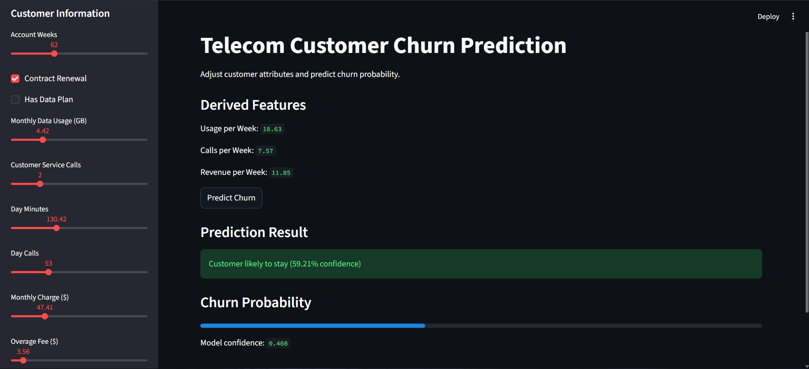
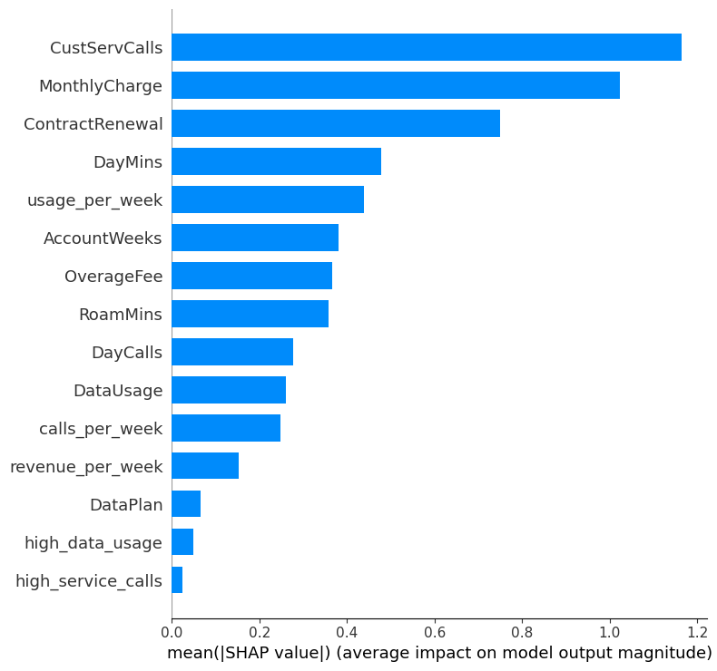
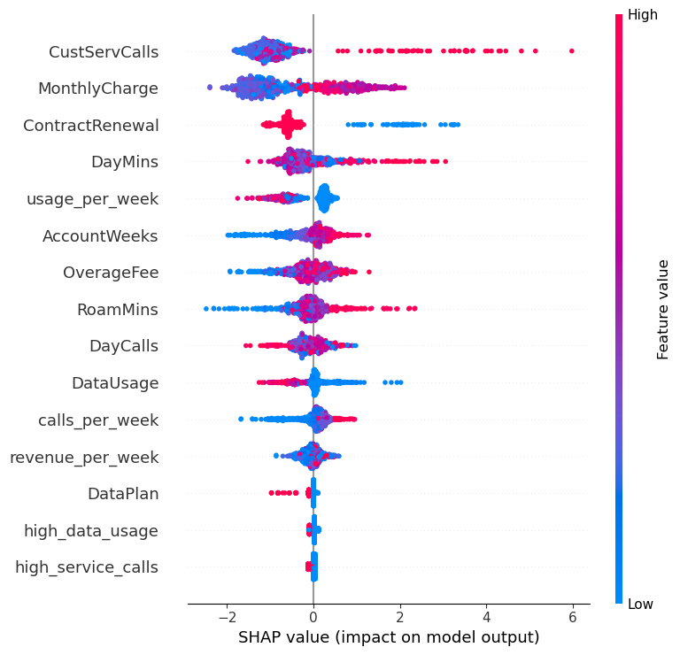

# Customer Churn Prediction with Explainable AI

## Overview
This project predicts whether a telecom customer is likely to churn using machine learning. The model analyzes customer usage patterns, billing information, and service interactions to estimate the probability that a customer will leave the service.

The project also includes an interactive dashboard built with Streamlit that allows users to simulate customer profiles and view churn predictions in real time.

## Dashboard Preview



The dashboard allows users to input customer attributes and receive churn predictions instantly.

---

## Key Features

- Data preprocessing and cleaning  
- Feature engineering to capture usage patterns  
- Handling class imbalance using SMOTE  
- Gradient boosting model for churn prediction  
- Model explainability using SHAP values  
- Interactive prediction dashboard built with Streamlit  

---

## Tech Stack

- Python  
- Pandas  
- NumPy  
- Scikit-learn  
- XGBoost  
- SHAP  
- Streamlit  

---

## Project Structure

```
Customer-Churn-Prediction/
│
├── app.py
├── churn_model.pkl
├── Customer_Churn_Prediction.ipynb
├── requirements.txt
├── README.md
│
└── images
    ├── dashboard.png
    ├── shap_feature_importance.png
    └── shap_summary.png
```

---

## Feature Engineering

Several engineered features were created to better capture customer behavior patterns:

- **usage_per_week** – derived from call usage  
- **calls_per_week** – call frequency per week  
- **revenue_per_week** – normalized revenue contribution  
- **high_data_usage** – indicator for heavy data users  
- **high_service_calls** – indicator for frequent support interactions  

These engineered features allow the model to better capture patterns related to customer churn.

---

## Model Training

The training pipeline includes the following steps:

1. Data preprocessing and cleaning  
2. Feature engineering  
3. Handling class imbalance using SMOTE  
4. Training an XGBoost classifier  
5. Model evaluation and validation  

The trained model is saved as a `.pkl` file and used by the Streamlit application for predictions.

---

## Model Explainability

To understand the model's decision-making process, SHAP (SHapley Additive Explanations) was used to interpret feature importance and prediction contributions.

### SHAP Feature Importance



This plot highlights which features contribute most strongly to churn predictions.

### SHAP Summary Plot



The summary plot shows how feature values influence model predictions.

### Key Insights

- Higher monthly charges increase churn probability  
- Frequent customer service calls strongly correlate with churn  
- Lower account tenure often corresponds to higher churn risk  

---

## Streamlit Dashboard

An interactive dashboard built using Streamlit allows users to explore churn predictions by adjusting customer attributes.

Features of the dashboard include:

- Interactive sliders and checkboxes for customer attributes  
- Real-time churn prediction  
- Probability visualization  
- Automatic calculation of engineered features  

---

## Future Improvements

- Deploy the Streamlit application online  
- Integrate SHAP explanations directly into the dashboard  
- Experiment with additional machine learning models  
- Implement a fully automated ML pipeline
- 
